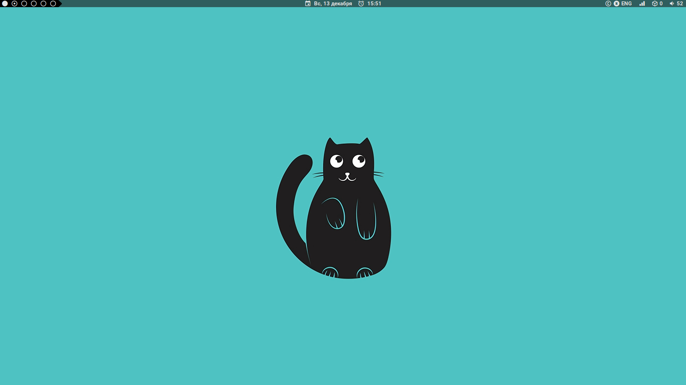
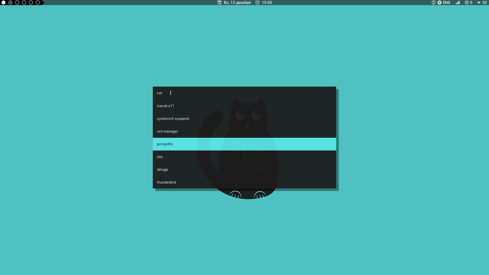
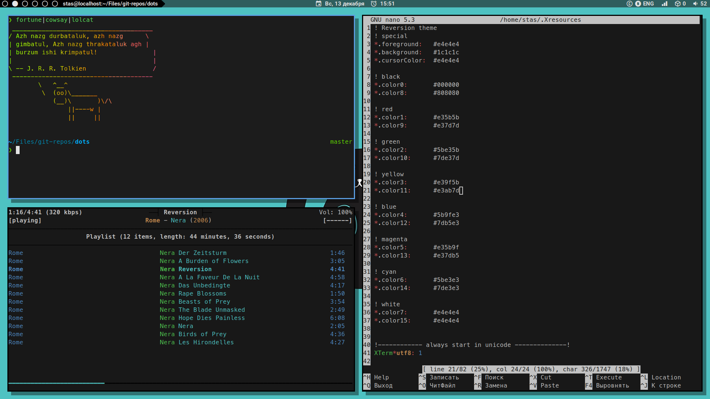

# There's no place like `~/`

## Dependencies

### Packages

Add here the list of packages...

### Fonts

Add here the list of used fonts...

## Installation

Clone the repository:

  `git clone https://github.com/qwertyiop/my_fedora_setup.git`

Use `stow` to install:

  `stow -d SOURCE -t TARGET CONFIG --dotfiles`

## Openbox window modes

To do

## Openbox keybindings

To do
  

## System config

Samba, systemd-networkd and dnf config files go here