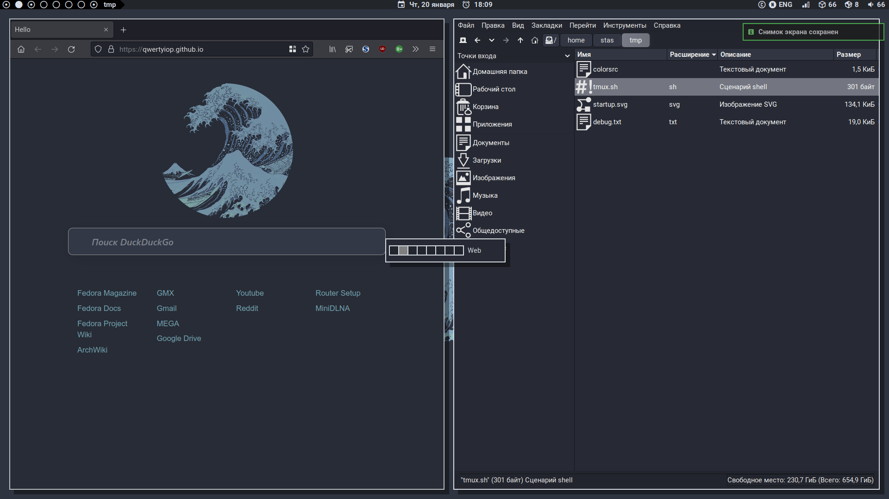

# There's no place like ~/

## Dependencies

### Packages

`rxvt-unicode` `dunst` `git` `grc` `nnn` `lightdm-gtk` `lsd` `mpd` `mpc` `npmpcpp` `nano` `openbox` `PackageKit-command-not-found` `pcmanfm` `picom` `polybar` `qt5ct` `redshift` `rofi` `stow` `tmux` `zsh` `zsh-autosuggestions` `zsh-syntax-highlighting`

Custom scripts rely on:

`maim` `xdotool` `libnotify`— to make screenshots 
`xrandr`— to automatically switch between dual- and single-head modes 
`yad`  `xdotool`— for Polybar popup calendar 

Dunst needs `numix-icon-theme` for notification icons

### Fonts

`Roboto`— for graphical apps and user interface 
`Meslo LGM Nerd Font Mono`— for terminal emulator 
`Terminus Powerline`— for TTY 
`Material Design Icons Desktop` and `Powerline Extra Symbols`— for glyphs in Polybar 

## Installation

Clone the repository:

  `git clone https://github.com/qwertyiop/dotfiles.git`

Use `stow` to install:

  `stow -d [SOURCE] -t $HOME --ignore=\.bak --dotfiles [CONFIG]`

## Openbox window modes

To do

## Openbox keybindings

To do

## ToDo

* This README

* Install scripts

* Whatever else
